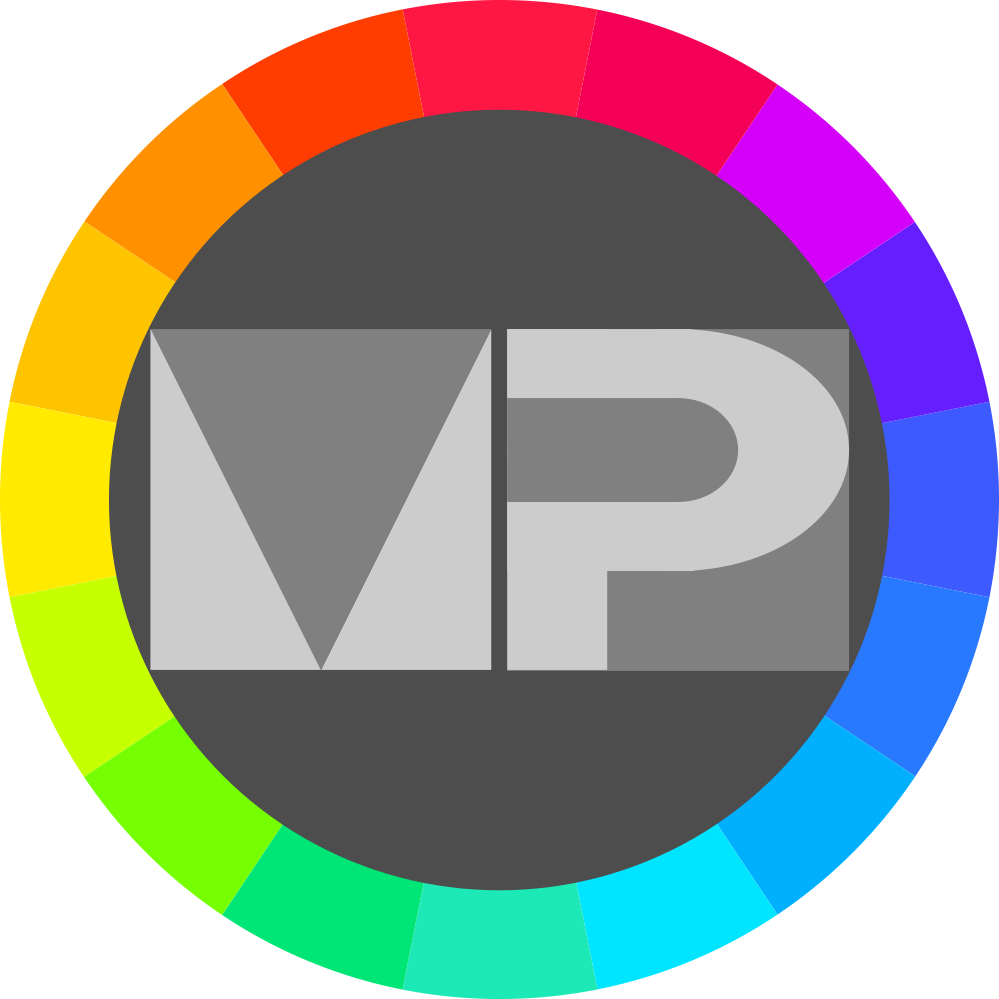

# material_palette

A color palette from Flutter's predefined material colors. Yes, yet another color palette.

Demos are here: [media/demos](media/demos)

## Warning

I'm using this project to learn Flutter and few related packages. That's why something may be wrong or anything else. If you found anything like that - welcome to issues :)

### Initial commit

- App has 2 screens - the palette screen where shown all base colors predefined in Flutter (from red to blueGrey).
- App works with [shared_preferences](https://pub.dev/packages/shared_preferences) package to store few settings.
- [auto_route](https://pub.dev/packages/auto_route) package used to simplify usage of [navigation and routing mechanism 2.0](https://flutter.dev/docs/development/ui/navigation)
- App's state currently includes 3 bool values:
  - if palette page should be displayed as list or grid
  - if shades page should be displayed as list or grid
  - if app theme is dark or light
- App's state is managed with [flutter_bloc](https://pub.dev/packages/flutter_bloc) package by using single [Cubit](https://bloclibrary.dev/#/coreconcepts?id=cubit) for 3 bool values described above.

### Next steps

- [x] ~~Copy HEX value of color when pressing concrete shade~~ Done, showing 3sec snackbar notification after copying
- [x] ~~Add "Settings" page with switches for settings~~ Settings can be opened from colors screen by settings button in the app bar
- [x] ~~Check if grid with 3 columns will work nice. If yes, then add ability to increase columns count in settings~~ In settings can be changed by slider. Now values limited between 2 and 3
- [x] ~~Add "About" page or probably add such section into settings~~ "About" added into Settings screen.
- [x] Add support for few languages by official [flutter_localizations](https://flutter.dev/docs/development/accessibility-and-localization/internationalization) package
- [x] Create an icon for the app
- [x] Add ability to specify language in settings
- [x] Add [url_launcher](https://pub.dev/packages/url_launcher) package to be able forward user to browser for the specified url (repo url, update url and etc)
- [ ] Add update checks with [http](https://pub.dev/packages/http) package
- [ ] Instead of copying HEX value, open dialog where few next color's representations will be shown:

  - HEX value
  - RGB value with alpha channel value
  - Flutter's variable (i.e. `Colors.red[400]` or `Colors.blueGrey.shade500`)

- [ ] **IMOPRTANT** learn testing
- [ ] **Probably** return FloatingActionButton widget instead of IconButton in the AppBar, but this required animation.
- [ ] **Probably** add screen with RGB selector (sliders for ARGB channels)
- [ ] **Probably** add screen for "Collections" where user can create a named folder and add into it some colors with giving them any meaningfull name. And for persistent storage probably use sqlite database
