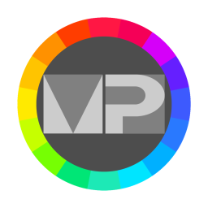

# Material Palette 1.1.2+4



A color palette from Flutter's predefined material colors. Yes, yet another color palette.

Few demo gifs are here: [media/demos](media/demos)

Also there is available web version: [https://nek-ra.github.io/flutter_material_palette/](https://nek-ra.github.io/flutter_material_palette/)

P.S.: It's available because Flutter can provide web output while all project dependecies have web support.

## Warning

I'm using this project to learn Flutter and few related packages. That's why something may be wrong, incorrect and so on. If you found any problem or have advices how to improve app - welcome to issues :)

## Download

**IMPORTANT**: App not yet optimized for wide screens!

### Android

For android device you can use [Google Play](https://play.google.com/store/apps/details?id=io.github.nek_ra.material_palette) or [Github Releases](https://github.com/NEK-RA/flutter_material_palette/releases).

While Google Play uses AppBundle files (result is split-apk on device), Github Releases contain standard apk files for ARMv7 (32-bit), ARMv8a (64-bit) and x86_64 (64-bit).

### Windows

**Flutter supported only 64-bit Windows 7+**, and now app didn't published to MS Store or anywhere else. 

ZIP archive with app is provided in [Github Releases](https://github.com/NEK-RA/flutter_material_palette/releases). ZIP file also contain shortcut to `%appdata%\https___nek-ra.github.io` - here will be folder `Material Palette` with file `shared_preferences.json`, where stored all settings of the app.

Unzipped folder with all app files weights about 22MB.

### Linux

Project was built on Linux Mint 20.1 (Cinnamon desktop).

AppImage package was added to [Github Releases](https://github.com/NEK-RA/flutter_material_palette/releases) at 12th November of 2021. Currently I don't plan to package it into other formats. If you wish more package formats - welcome to issues :)

Also I added archive with binaries (as is, not packaged) to [Github Releases](https://github.com/NEK-RA/flutter_material_palette/releases). It is a `tar.gz` archive. Inside it contain built project and a `README.txt` where described location of settings file (`$HOME/.local/share/flutter_material_palette`) as well as required libraries, which are:

- libgtk-3-0
- libblkid1
- liblzma5

For Debian based distros install them by

```sh
sudo apt install libgtk-3-0 libblkid1 liblzma5
```

Notice: They're required by any Flutter project. Look here - [https://flutter.dev/desktop#linux](https://flutter.dev/desktop#linux)

### Initial commit

- App has 2 screens - the palette screen where shown all base colors predefined in Flutter (from red to blueGrey).
- App works with [shared_preferences](https://pub.dev/packages/shared_preferences) package to store few settings.
- [auto_route](https://pub.dev/packages/auto_route) package used to simplify usage of [navigation and routing mechanism 2.0](https://flutter.dev/docs/development/ui/navigation)
- App's state currently includes 3 bool values:
  - if palette page should be displayed as list or grid
  - if shades page should be displayed as list or grid
  - if app theme is dark or light
- App's state is managed with [flutter_bloc](https://pub.dev/packages/flutter_bloc) package by using single [Cubit](https://bloclibrary.dev/#/coreconcepts?id=cubit) for 3 bool values described above.

### Next steps

- [x] ~~Copy HEX value of color when pressing concrete shade~~ Done, showing 3sec snackbar notification after copying
- [x] ~~Add "Settings" page with switches for settings~~ Done, "Settings" screen can be opened from colors screen by settings button in the app bar
- [x] ~~Check if grid with 3 columns will work nice. If yes, then add ability to increase columns count in settings~~ Done, in settings can be changed by slider. Now values limited between 2 and 3
- [x] ~~Add "About" page or probably add such section into settings~~ Done, "About" added into "Settings" screen.
- [x] ~~Add support for few languages by official [flutter_localizations](https://flutter.dev/docs/development/accessibility-and-localization/internationalization) package~~ Done
- [x] ~~Create an icon for the app~~ Done
- [x] ~~Add ability to specify language in settings~~ Done
- [x] ~~Add [url_launcher](https://pub.dev/packages/url_launcher) package to be able forward user to browser for the specified url (repo url, update url and etc)~~ Done
- [x] ~~Instead of copying HEX value, open dialog where few next color's representations will be shown:~~

  - ~~HEX value~~ Done
  - ~~RGB value with alpha channel value~~ Done RGB only, because alpha channel (for rgba) is not used at all (always `255` value), so there's no transparent colors
  - ~~Flutter's variable (i.e. `Colors.red[400]` or `Colors.blueGrey.shade500`)~~ Done

- [x] ~~Add update checks with [http](https://pub.dev/packages/http) package~~ Done
- [x] ~~Create AppImage build for Linux~~ Done, about 25MB size reached
- [ ] Add check for available screen width to adjust ColorCard size for that and allow set limit for columns in grid depending on that info
- [ ] **IMOPRTANT** learn testing
- [ ] **Probably** return FloatingActionButton widget instead of IconButton in the AppBar, but this required animation.
- [ ] **Probably** add screen with RGB selector (sliders for ARGB channels)
- [ ] **Probably** add screen for "Collections" where user can create a named folder and add into it some colors with giving them any meaningfull name. And for persistent storage probably use sqlite database
